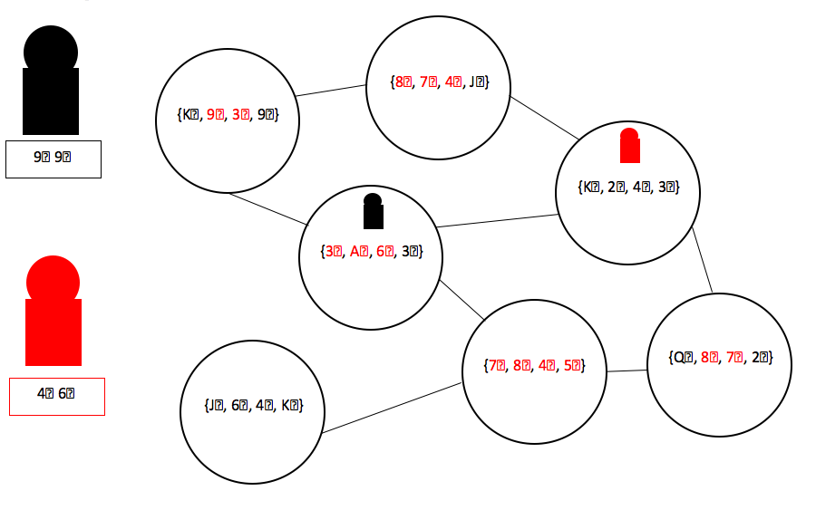

# AI Final Project: Three Card Pickup Poker

Deadlines:
   - Friday, April 28 – Initial test agent due
   - Tuesday, May 2 – Results of First round discussed
   - Friday, May 12 – Final agent/report submission

Groups: You may work in groups of up to three students.  Turn in a single submission, clearly listing the students in the group.  For the final report you must include a brief statement of the contributions of each team member.  

Goals:
   - Make a better 5-card Poker hand than your opponent.
   - Design a winning strategy that is robust to change and uncertainty.
   - Consistently win round-robin tournaments against all other agents.

Rules:
   - Each player has 2 private cards from a standard 52-card deck.
   - Players will then take turns traversing a connected graph containing cards.
   - Games will be procedurally generated based on a set of parameters:
        - Number of nodes
        - Graph connectivity
        - Amount of uncertainty
        - Turn limit
   - Max of 48 nodes (4 cards have been dealt) but expect graphs to be much smaller.
   - Players will start at separate nodes and can see the entire graph.
   - Players can only move along one edge each turn.
   - Nodes contains possible cards only one is the actual card (actual does not change).
   - On their turn a player can decide to pick up the node’s card added to their hand.
   - Picking up the card removes it from the graph and is shown to all players.
   - A player must pick up 3 cards by the end of the game or automatically lose.
   - Players will not be allowed to pick up more than 3 cards.
   - Parameters can only change between tournaments not during a match.

For fairness each game will be played twice where agents swap starting positions and starting hands. They will not be allowed a history of the previous match.

Standard Poker Rankings - http://en.wikipedia.org/wiki/Poker_probability

Hand | Frequency | Probability | Cumaltive | Odds
---- | --------- | ----------  | --------- | ----
Royal flush | 4,324 | 0.0032% | 0.0032% | 30,939 : 1
Straight flush (excl. royal flush) | 37,260 | 0.0279% | 0.0311% | 3,589.6 : 1
Four of a kind | 224,848 | 0.168% | 0.199% | 594 : 1
Full house | 3,473,184 | 2.60% | 2.80% | 37.5 : 1
Flush | 4,047,644 | 3.03% | 5.82% | 32.1 : 1
Straight | 6,180,020 | 4.62% | 10.4% | 20.6 : 1
Three of a kind | 6,461,620 | 4.83% | 15.3% | 19.7 : 1
Two pair | 31,433,400 | 23.5% | 38.8% | 3.26 : 1
One pair | 58,627,800 | 43.8%| 82.6% | 1.28 : 1
No pair | 23,294,460 | 17.4% | 100% | 4.74 : 1
Total | 133,784,560 | 100% | 100% |0 : 1

Example Game:
 
Deliverables

To submit agents, you should submit java files that are documented subclasses of the Player class in the provided source code. Do NOT submit a full java project, only the source code for your agents.

For the initial test submission, you only need to submit a single functional agent that implements a non-trivial strategy (i.e., you should not just use one of the provided example agents, but should make some attempt to design a new agent).  The main purpose for this is to make sure you understand the provided code, and to test the infrastructure. Submitting a functioning initial agent will count for 10% of your final project score.  

For the final submission, you should implement and evaluate at least four (4) different agents for playing this game, ranging from simple agents that use basic heuristics to more sophisticated agents.  At least two of these agents should make use of the techniques we have studied in the course (e.g., minimax search, UCT, genetic algorithms, reinforcement learning, etc.) You will identify your best agent to participate in the final tournament, based on your evaluation of the agents you have developed. 

 You should turn in:
•	The source code for four agents you have developed and tested, with varying levels of sophistication 
•	A report that describes your agents in detail, and provides the results of your own evaluation of the strength of these agents based on running your own tournaments. 
•	Your report should clearly identify the agent you believe is the best; we will use this agent to participate in the final class tournament 

Evaluation Criteria:
•	Clean and well documented code
•	Clear explanations of agent strategies and report of experimental evaluation
•	Creative, non-trivial agents the implement intelligent behaviors
•	Use of AI methods from the course
•	Agent performs well in tournaments against other agents
